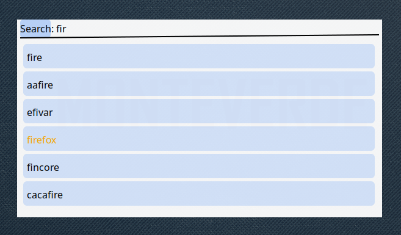

# Rex
Rex is a lightweight application launcher.



---

## Description

Rex is currently in the earliest stages of development as part of the **Monteverde Linux** distribution. It is a lightweight application launcher, but lacks a significant amount of functionality and stability at this point. Many features are still in progress, and it is not yet suitable for production use.


## Build
To build Rex from source, ensure you have the following dependencies installed:

### **Dependencies**
- **CMake** (Version 3.30 or higher)
- **C++ standard 17 Compatible Compiler** (e.g., GCC or Clang)
- **XCB Libraries**:
  - `xcb`
  - `xcb-keysyms`
- **Cairo** (With XCB support)
- **Pango** (For text rendering)

### Install these on popular Linux distributions:
- **Arch Linux**:
  ```bash
  sudo pacman -S cmake gcc libxcb xcb-util-keysyms cairo pango
### Build Instructions
   
1. **Create a build directory**:
    ```bash
    mkdir build && cd build
2. **Configure the project using CMake**:
    ```bash
    cmake ..
3. **By default, the build type is set to Debug. You can specify a different build type**:
    ```bash
    cmake -DCMAKE_BUILD_TYPE=Release ..
4. **Build the project**:
    ```bash
    cmake --build .
## License
This project is licensed under the BSD 3-Clause License. See the [LICENSE](LICENSE) file for more details.